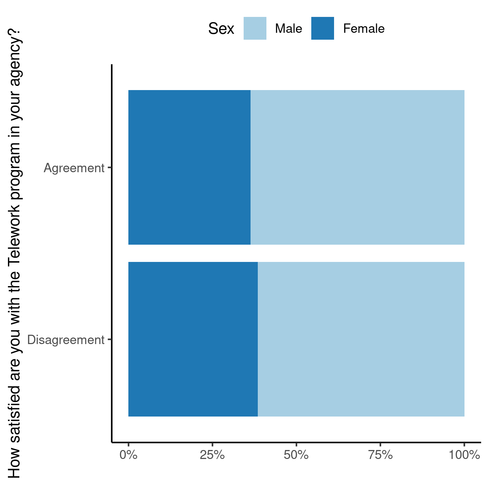
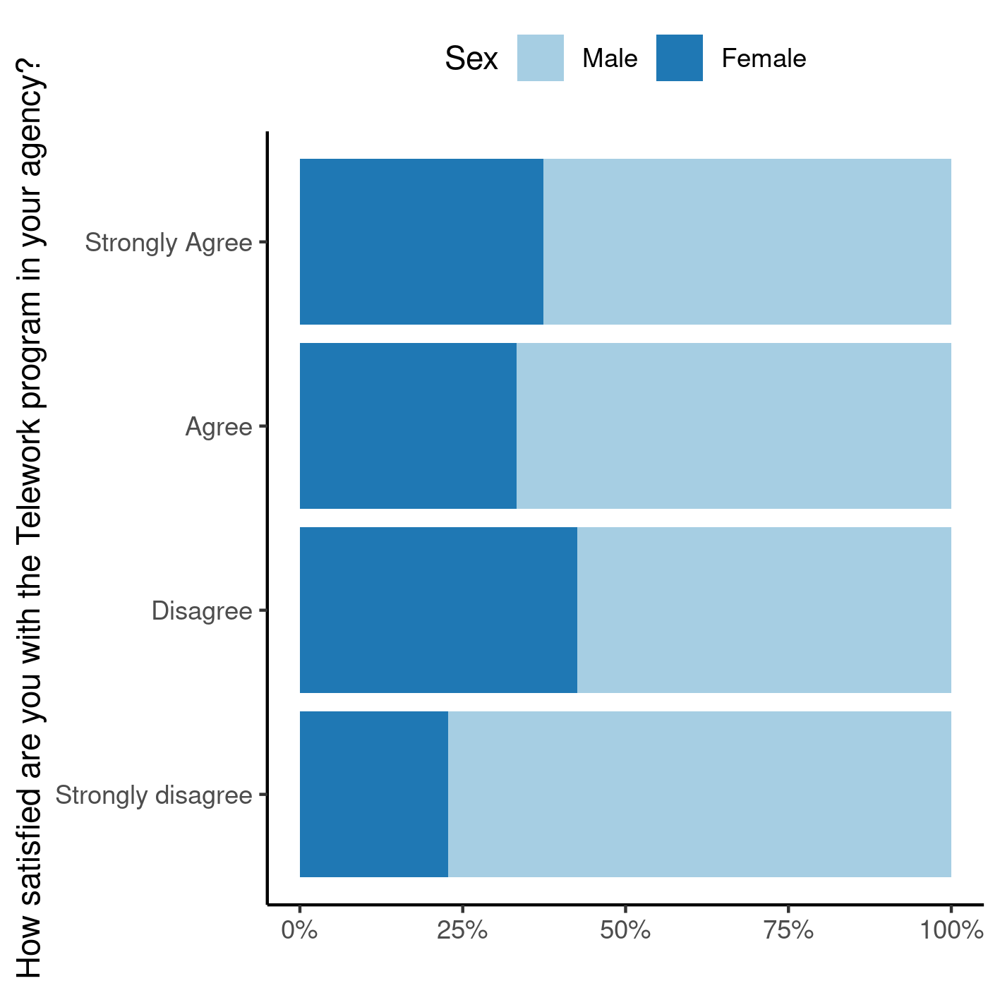

---

\newpage

**Association between leadership commitment and telework satisfaction at NASA (2020): unweighted sex-adjusted stratified analysis**

**Document version**

|Version |Alterations     |
|:-------|:---------------|
|01      |Initial version |

---

# Abbreviations

# Context

## Objectives

## Data reception and cleaning

# Methods

## Variables

### Primary and secondary outcomes

### Covariates

## Statistical analyses

This analysis was performed using statistical software `R` version 4.1.2.

# Results

## Study population and follow up

The raw database contained 10588 surveys, of which 1183 incomplete cases were removed.
Of the complete cases 1920 participants did not agree nor disagree with at least one of the survey questions.
These did not meet the inclusion criteria and were also removed from the analysis.
After the inclusion and exclusion criteria were applied the final number of surveys in the analysis is 7485.
Table 1 shows the characteristics of the surveys included in the final analysis.

Table: **Table 1** Characteristics of the study population.

|                             **Characteristic**                             | **N = 7,485** |
|:--------------------------------------------------------------------------:|:-------------:|
|                               __Sex, n (%)__                               |               |
|                                    Male                                    |  4,764 (64%)  |
|                                   Female                                   |  2,721 (36%)  |
| __How satisfied are you with the Telework program in your agency?, n (%)__ |               |
|                             Strongly disagree                              |   22 (0.3%)   |
|                                  Disagree                                  |   87 (1.2%)   |
|                                   Agree                                    |  1,911 (26%)  |
|                               Strongly Agree                               |  5,465 (73%)  |
|   __Managers promote communication among different work units., n (%)__    |               |
|                             Strongly disagree                              |  129 (1.7%)   |
|                                  Disagree                                  |  328 (4.4%)   |
|                                   Agree                                    |  3,709 (50%)  |
|                               Strongly Agree                               |  3,319 (44%)  |

One third of the employees at NASA are women
(36.4%, Table 1).
Both survey questions
addressed in this study showed most NASA employees demonstrated high levels of satisfaction when the survey was conducted.
The proportion of employees that agree or strongly agree with the satisfaction question
(q58 -- How satisfied are you with the Telework program in your agency?)
was 98.5%.
The proportion of employees that agree or strongly agree with leadership commitment
(q29 -- Managers promote communication among different work units (for example, about projects, goals, needed resources))
was 93.9%.
Figure 1 shows how both sexes answered these questions.

**Figure 1** Dichotomized survey responses, by sex.

Men and women tended to answer the satisfaction question at the same rates in 2020.
Of the 7376 NASA employees that are in agreement with the satisfaction question,
36.3% were women,
and of the 109 employees that are in disagreement,
women were 38.5% (Figure 1).

## Association between leadership commitment and telework satisfaction

In order to compare how the responses to the leadership commitment and
telework satisfaction
<!-- employee development -->
relate to each other, a cross-tabulation of all answers from each study participant is shown in Table 2.
This cross tabulation shows that the largest proportion of survey respondents answered Agree or Strongly agree to both questions (see observations).

In order to estimate the size of the effect of the association a binary categorization was performed between the two survey responses, where agreement aggregates all answers 4 (agree) and 5 (strongly agree).
Table 2 shows the contingency table that cross-tabulates these variables.
There is a detectable statistical difference in the distributions of the two responses (see section Observations), where the chi-square adjusted for survey design was significant.

The overall (unadjusted) effect of the association was significant (OR: 7.47, 95% CI: [4.86, 11.24], p<0.001).
This means that when survey respondents perceive leadership commitment, they are 7 times as likely to report
telework satisfaction
<!-- employee development -->
as participants that do not perceive such commitment from leadership.
Alternatively this translates to a 6-fold increase in the group of interest when compared to the reference group.

In order to control for a possible confounder between the association and the sex of the study participant, the analysis was stratified by sex.
The Mantel-Haenszel adjustment for the OR was similar to the overall unadjusted effect estimate
(adjusted OR: 7.41, 95% CI: [4.88, 11.25], p<0.001).
For comparison, the relative difference between the overall effect of association and the adjusted effect is on the order of
0.7%,
so we may rule out confounding between sex the association in this study.
There is no need to report the adjusted OR in this context.

Table: **Table 2** caption

|**Group** |**Characteristic**                                                | Disagreement | Agreement | **Total** |
|:---------|:-----------------------------------------------------------------|:------------:|:---------:|:---------:|
|Overall   |__Managers promote communication among different work units., n__ |              |           |           |
|          |Disagreement                                                      |      34      |    423    |    457    |
|          |Agreement                                                         |      75      |   6,953   |   7,028   |
|          |__Total, n__                                                      |     109      |   7,376   |   7,485   |
|Males     |__Managers promote communication among different work units., n__ |              |           |           |
|          |Disagreement                                                      |      21      |    248    |    269    |
|          |Agreement                                                         |      46      |   4,449   |   4,495   |
|          |__Total, n__                                                      |      67      |   4,697   |   4,764   |
|Females   |__Managers promote communication among different work units., n__ |              |           |           |
|          |Disagreement                                                      |      13      |    175    |    188    |
|          |Agreement                                                         |      29      |   2,504   |   2,533   |
|          |__Total, n__                                                      |      42      |   2,679   |   2,721   |

Odds ratios + chi-square:

- Overall: OR: 7.47, 95% CI: [4.86, 11.24], p<0.001
- Adjusted CMH: OR: 7.41, 95% CI: [4.88, 11.25], p<0.001
- Men: OR: 8.21, 95% CI: [4.73, 13.83], p<0.001
- Women: OR: 6.45, 95% CI: [3.17, 12.42], p<0.001

# Observations and Limitations

# Conclusions

One third of NASA employees in this study are women.
Both men and women tended to derive satisfaction at the workplace in similar rates in 2020.

# References

- **SAP-2022-010-GJ-v01** -- Analytical Plan for Association between leadership commitment and telework satisfaction at NASA (2020): unweighted sex-adjusted stratified analysis

# Appendix

## Exploratory data analysis

**Figure A1** Raw survey responses, by sex.

## Availability

Both this document and the corresponding analytical plan (**SAP-2022-010-GJ-v01**) can be downloaded in the following address:

<!-- This document can be downloaded in the following address: -->

<https://philsf-biostat.github.io/SAR-2022-010-GJ/>

<!-- The client has requested that this analysis be kept confidential. -->
<!-- Both this document and the corresponding analytical plan (**SAP-2022-010-GJ-v01**) are therefore not published online and only the title and year of the analysis will be included in the consultant's Portfolio. -->
<!-- The portfolio is available at: -->

<!-- <https://philsf-biostat.github.io/> -->

## Analytical dataset

Due to confidentiality the data-set used in this analysis cannot be shared online in the public version of this report.

| id  | dsex | dv | iv | dv2 | iv2 |
|:---:|:----:|:--:|:--:|:---:|:---:|
|  1  |      |    |    |     |     |
|  2  |      |    |    |     |     |
|  3  |      |    |    |     |     |
| ... |      |    |    |     |     |
|  N  |      |    |    |     |     |

Table: **Table A1** Analytical dataset structure
